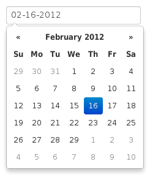
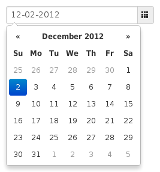
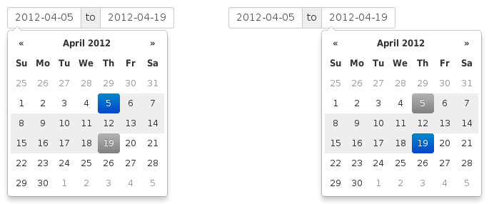

Markup
=======

The following are examples of supported markup.  On their own, these will not provide a datepicker widget; you will need to instantiate the datepicker on the markup.

input
-----

The simplest case: focusing the input (clicking or tabbing into it) will show the picker.

.. code-block:: html

    <input type="text" value="02-16-2012">

component
---------

Adding the ``date`` cl***REMOVED*** to an ``input-append`` or ``input-prepend`` bootstrap component will allow the ``add-on`` elements to trigger the picker.

.. code-block:: html

    

        <input type="text" value="12-02-2012">
        <i cl***REMOVED***="icon-th"></i>
    

.. _daterange:

date-range
----------

Using the ``input-daterange`` construct with multiple child inputs will instantiate one picker per input and link them together to allow selecting ranges.

.. code-block:: html

    

        <input type="text" cl***REMOVED***="input-small" value="2012-04-05" />
        to
        <input type="text" cl***REMOVED***="input-small" value="2012-04-19" />
    

inline or embedded
------------------

Instantiating the datepicker on a simple div will give an embedded picker that is always visible.

.. code-block:: html

    

.. figure:: _static/screenshots/markup_inline.png
    :align: center
